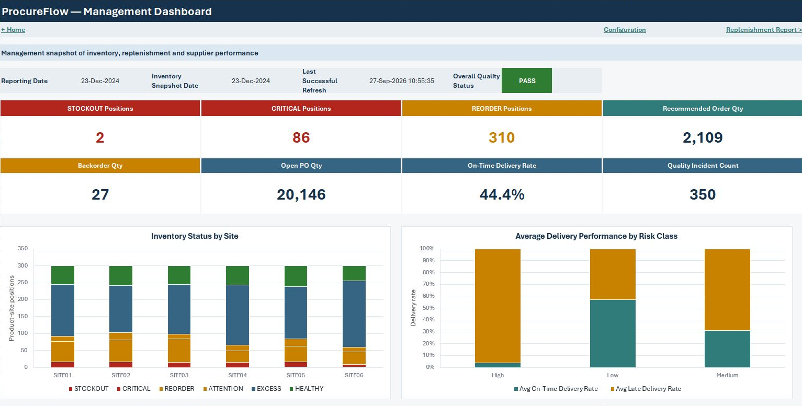
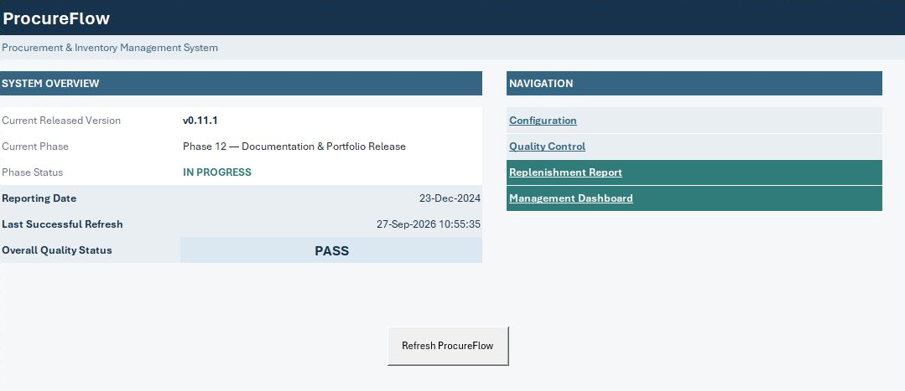
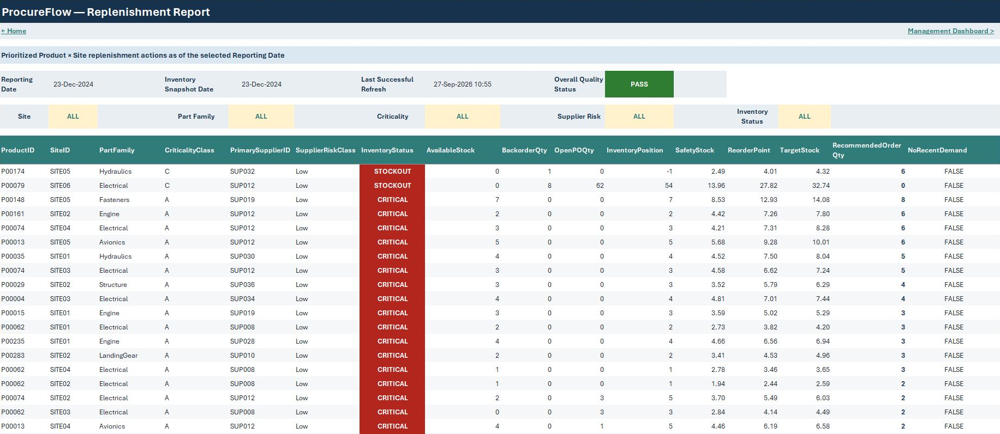
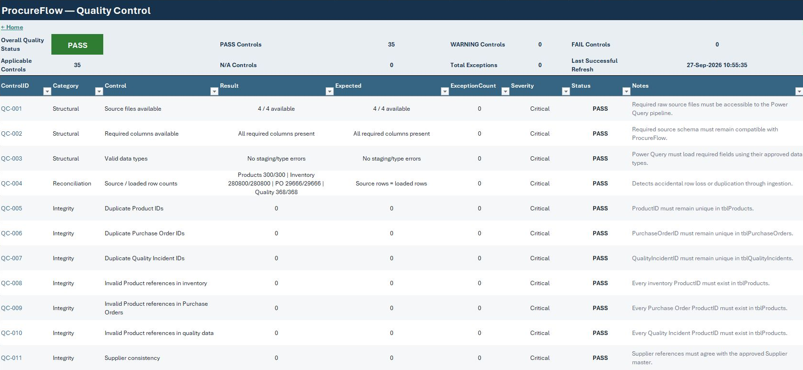

# ProcureFlow

ProcureFlow is an Excel-based Procurement & Inventory Management System designed as a professional end-to-end workbook for procurement, inventory, replenishment and supplier-performance workflows.

The solution was developed incrementally in Microsoft Excel with reproducible data ingestion, structured operational models, auditable formulas, validation controls and Git/GitHub documentation.

## Current Project Status

Project status:

`COMPLETED`

Current released version:

`v1.0.1`

Final completed phase:

**Phase 12 — Documentation & Portfolio Release**

Phase 12 status:

**COMPLETED**

Final Phase Pull Request:

`#15 — Phase 12 — Documentation & Portfolio Release`

Final merge commit:

`d3d382a485a890fbd4cb692dd261127d1633b06b`

Phase tag:

`phase-12-complete`

Phase 12 completion release:

`v1.0.0`

Post-release maintenance:

`v1.0.1` — documentation and repository-state synchronization only. The executable workbook remains the validated `v1.0.0` artifact.
## Completed Phases

### Phase 0 — Project Design

Status:

`COMPLETED`

Version:

`v0.1.0`

Established the initial project specification, architecture, roadmap, decision framework and Git/GitHub governance.

### Phase 1 — Data Design

Status:

`COMPLETED`

Version:

`v0.2.0`

Established and validated the logical data model, field definitions, grains, source relationships and data-quality baseline.

### Phase 2 — Workbook Foundation

Status:

`COMPLETED`

Version:

`v0.3.0`

Created the physical macro-enabled Excel workbook, configuration layer, navigation, worksheet architecture, visual conventions, Named Ranges and initial controls.

### Phase 3 — Power Query Pipeline

Status:

`COMPLETED`

Technical release:

`v0.4.0`

Phase 3 corrective documentation release:

`v0.4.1`

Implemented the reproducible Power Query pipeline from raw CSV files through source, staging, dimension and fact queries into structured Excel Tables.

### Phase 4 — Operational Model

Status:

`COMPLETED`

Version:

`v0.5.0`

Completed implementation includes:

- Product × Site operational model;
- `tblReplenishment`;
- 1,800 validated Product × Site rows;
- Supplier operational model;
- `tblSupplierPerformance`;
- 40 validated Supplier rows;
- Product and Supplier master attributes;
- Reporting Date relationships;
- weekly Inventory Snapshot resolution;
- On-Hand Quantity;
- Blocked Quantity;
- Backorder Quantity;
- completed historical-demand window preparation;
- Lead-Time inputs;
- Purchase Order inputs prepared for later business logic;
- versioned Excel formula documentation;
- full post-implementation Refresh validation.

Phase 4 intentionally stopped before Phase 5 business calculations.

### Phase 5 — Business Logic & Advanced Formulas

Status:

`COMPLETED`

Version:

`v0.6.0`

Corrective documentation releases after Phase 5:

- `v0.6.1` — synchronized Phase 5 release metadata; commit `0f447a3599556a0444103d43cdfc49ff1eef48cb`.
- `v0.6.2` — finalized Phase 5 release synchronization; commit `1ae9dfecdba3badd7bf071a35341994b66594602`.

These corrective versions did not change the formal Phase 5 completion version, which remains `v0.6.0`.

Completed implementation includes:

- Historical Demand;
- Average Weekly Demand;
- demand variability;
- historical Actual Lead Time;
- Lead-Time variability;
- Effective Lead-Time fallback;
- Open PO Quantity;
- Available Stock;
- configurable Service Levels;
- Safety Stock;
- Reorder Point;
- Inventory Position;
- Target Stock;
- Recommended Order Quantity;
- Inventory Status;
- NoRecentDemand;
- On-Time Delivery metrics;
- Late Delivery metrics;
- partial-receipt metrics;
- supplier Lead-Time metrics;
- supplier Quality Incident counts;
- documented and validated Excel business formulas.

Phase 5 validation completed with zero formula errors. The Product × Site replenishment engine contains 1,800 validated rows and Supplier Performance contains 40 validated Suppliers.

### Phase 6 — Quality Control System

Status:

`COMPLETED`

Version:

`v0.7.0`

Implemented the centralized Quality Control framework, reconciliation controls, Power Query technical-health feed and validated PASS / WARNING / FAIL behavior.

### Phase 7 — Analysis & PivotTables

Status:

`COMPLETED`

Version:

`v0.8.0`

Implemented the Inventory, Procurement and Supplier analytical layers using PivotTables, PivotCharts, Slicers and Timelines, with source-to-Pivot reconciliation and full refresh validation.

### Phase 8 — VBA Foundations

Status:

`COMPLETED`

Version:

`v0.8.1`

Established practical VBA foundations using the real ProcureFlow workbook, validated readiness for production automation and preserved educational VBA separately from the operational workbook.

### Phase 9 — Automation

Status:

`COMPLETED`

Version:

`v0.9.0`

Implemented the production VBA automation layer, including controlled synchronous Power Query refresh, persistent automation state, staged Quality Control orchestration, PivotTable refresh coordination, user-facing refresh execution, controlled failure handling and late-stage successful-refresh rollback protection.

## Post-Phase-9 Corrective Releases

### v0.9.1

Documentation-only synchronization after the Phase 9 release. Published through Pull Request `#11` with no changes to the executable workbook, VBA, Power Query or business logic.

### v0.9.2

Documentation-only cleanup before Phase 10, covering duplicated Phase 9 test evidence, obsolete architecture-status wording, corrective-release traceability, CURRENT_STATE normalization and establishment of v0.9.2 as the Phase 10 baseline.

### Phase 10 — Reporting & Dashboard

Status:

`COMPLETED`

Version:

`v0.10.0`

Implemented the operational replenishment report and management dashboard, including dynamic report filtering, reconciled management KPIs, validated dashboard visuals, final navigation, accessibility-conscious status presentation and integration with the existing production refresh workflow.

### Phase 11 — Testing & Hardening

Status:

`COMPLETED`

Version:

`v0.11.0`

Completed full-system regression, failure-path and edge-case validation, performance measurement, protection hardening, User Acceptance Testing and final end-to-end reconciliation.

### Phase 12 — Documentation & Portfolio Release

Status:

`COMPLETED`

Version:

`v1.0.0`

Finalized canonical documentation, operating guidance, release-asset validation, professional UI/UX visual polish, targeted post-polish regression, portfolio screenshots, public README presentation and final release acceptance.

Final targeted post-polish regression completed with:

`9 / 9 PASS`

Final Definition of Done:

`32 / 32 ACCEPTED`

No critical known defect remains open.
## Current Workbook

Executable workbook:

`workbook/ProcureFlow.xlsm`

Target application:

Microsoft Excel 365 Desktop for Windows.

The workbook currently contains the implemented and validated layered architecture for:

- configuration and control;
- Power Query ingestion and structured data;
- operational replenishment calculations;
- Supplier Performance calculations;
- centralized Quality Control;
- PivotTables, PivotCharts, Slicers and Timelines;
- VBA refresh orchestration;
- operational replenishment reporting;
- management dashboarding.

Technical implementation through Phase 11 was completed and validated, and Phase 12 completed final UI/UX visual polish, targeted post-polish regression, portfolio preparation and the final GitHub release gate in `v1.0.0`. The current maintenance release is `v1.0.1`, which changes documentation and repository-state metadata only; the executable workbook remains unchanged from `v1.0.0`.

## Portfolio Preview

### Management Dashboard

The management dashboard provides a reconciled view of inventory risk, replenishment, open purchase orders, backorders, supplier delivery performance and quality incidents.

### Home & Navigation

`00_HOME` provides the primary navigation and operating context, including Reporting Date, Last Successful Refresh and Overall Quality Status.

### Replenishment Report

The operational replenishment report provides prioritized Product × Site actions with configurable filtering and validated replenishment outputs.

### Quality Control

The centralized Quality Control layer exposes structural, reconciliation, integrity and business-rule controls with explicit PASS / WARNING / FAIL states.

Additional technical evidence, including the Power Query dependency view, is maintained under `screenshots/`.
## Technology Stack

ProcureFlow is intentionally centered on Excel.

Current and planned technologies include:

- Microsoft Excel 365 Desktop for Windows
- Excel Tables
- Structured References
- Power Query
- Excel formulas
- Dynamic Arrays
- Named Ranges and Named Formulas
- Data Validation
- Conditional Formatting
- PivotTables and PivotCharts
- Slicers and Timelines
- Macros
- Visual Basic for Applications (VBA)
- Git
- GitHub
- Markdown technical documentation

Power Pivot / Excel Data Model is not currently required.

## Implemented Data Layer

The current Power Query pipeline loads the following structured Excel Tables:

| Excel Table | Purpose | Validated Rows |
|---|---|---:|
| `tblProducts` | Product dimension | 300 |
| `tblSites` | Site dimension | 6 |
| `tblSuppliers` | Supplier dimension | 40 |
| `tblInventoryHistory` | Weekly Product × Site inventory history | 280,800 |
| `tblPurchaseOrders` | Purchase Order fact data | 29,666 |
| `tblQualityIncidents` | Supplier-quality incidents | 368 |
| `tblDate` | Daily Date dimension | 1,198 |
| `tblReplenishment` | Product × Site replenishment calculation engine | 1,800 |
| `tblSupplierPerformance` | Supplier-performance calculation model | 40 |

## Quick Start

1. Use Microsoft Excel 365 Desktop for Windows.
2. Preserve the repository folder relationship between `workbook/` and `data/raw/`.
3. Place the four required source CSV files in `data/raw/`:
   - `parts_master.csv`
   - `supply_chain_history.csv`
   - `purchase_orders.csv`
   - `quality_incidents.csv`
4. Open `workbook/ProcureFlow.xlsm`.
5. Review the business configuration in `01_CONFIG`.
6. Return to `00_HOME`.
7. Run the `Refresh ProcureFlow` button.
8. Confirm the workflow and Quality Control state before relying on refreshed outputs.
9. Use `40_RPT_Replenishment` for operational action and `41_DASH_Management` for management reporting.

The complete setup, refresh, operating and troubleshooting workflow is documented in:

`docs/USER_GUIDE.md`

## Documentation

Canonical project documentation is maintained under:

`docs/`

Important documents include:

- `docs/PROJECT_SPEC.md`
- `docs/ROADMAP.md`
- `docs/ARCHITECTURE.md`
- `docs/DECISIONS.md`
- `docs/CURRENT_STATE.md`
- `docs/DATA_DICTIONARY.md`
- `docs/TESTING.md`
- `docs/FORMULAS.md`
- `docs/USER_GUIDE.md`

Phase closeout documents are maintained under:

`docs/phases/`

The canonical documents, rather than this README alone, are the authoritative source for detailed project state and implementation decisions.

## Formula Versioning

Important Excel formulas implemented in the workbook are also maintained as text in:

`docs/FORMULAS.md`

This provides inspectable Git history for formulas that otherwise live inside the binary `.xlsm` workbook.

## Power Query Source Versioning

Executable Power Query M code lives inside:

`workbook/ProcureFlow.xlsm`

A synchronized text representation is maintained under:

`power-query/`

This allows Power Query implementation to be reviewed through normal Git and GitHub diffs.

## Development Approach

ProcureFlow was developed phase by phase.

Major functionality is not marked implemented until it has been:

1. designed;
2. created in the workbook;
3. validated with actual Excel evidence;
4. documented;
5. versioned in Git;
6. reviewed through the corresponding phase workflow.

Each completed phase uses a dedicated branch, Pull Request, merge, phase-completion tag and semantic version tag.

## Final Project State

ProcureFlow is complete.

Phase 12 completion version:

`v1.0.0`

Current maintenance release:

`v1.0.1`

Final phase:

**Phase 12 — Documentation & Portfolio Release**
## Portfolio Status

ProcureFlow is a completed portfolio-ready Excel Procurement & Inventory Management System.

Final release state:

- 32 of 32 Definition of Done criteria accepted;
- final workbook validated;
- 35 Quality Control checks PASS;
- targeted Phase 12 post-polish regression: 9 / 9 PASS;
- representative portfolio screenshots versioned;
- canonical documentation complete;
- Phase 12 closeout complete;
- no critical known defects;
- functional and portfolio release `v1.0.0`;
- current documentation maintenance release `v1.0.1`.
## License

ProcureFlow source code and original project documentation are licensed under the MIT License.

External datasets retain their own applicable licenses and terms.

