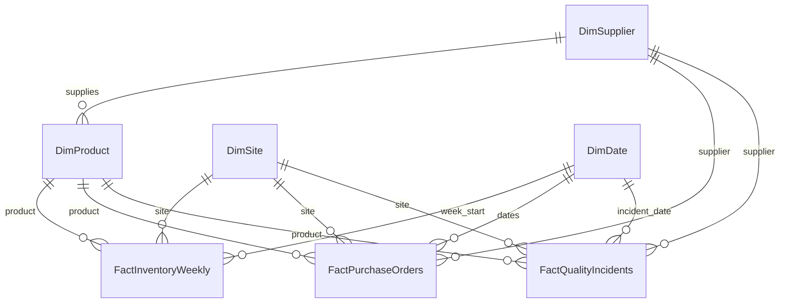
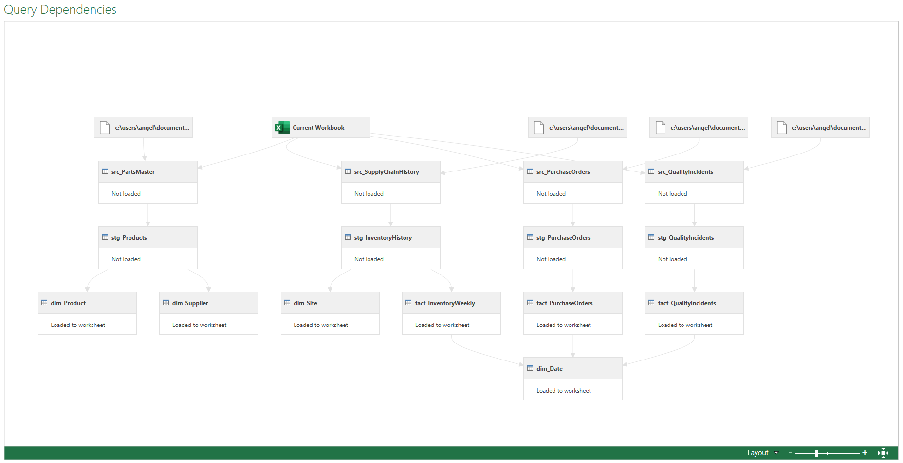

# ProcureFlow — Architecture

## Document Status

Status: CONFIRMED DESIGN BASELINE
Project State: IN DEVELOPMENT
Current Phase: Phase 3 — Power Query Pipeline
Current Phase Status: COMPLETED
Current Released Version: v0.4.1
This document defines the approved architecture of ProcureFlow and records implementation evidence as project phases are completed.

Architecture described here is a design baseline. Components must not be considered implemented until supported by actual workbook, query, formula, VBA or testing evidence.

---

# 1. Architecture Objective

ProcureFlow must provide a maintainable separation between:

- source data;
- ingestion and transformation;
- structured data;
- operational calculations;
- quality controls;
- analytical aggregation;
- automation;
- reporting;
- configuration.

The design must support both business usability and technical auditability.

---

# 2. High-Level Architecture

The approved conceptual flow is:

Source CSV files
→ Power Query ingestion
→ staging and validation
→ dimension and fact datasets
→ Excel Tables
→ operational calculation layer
→ quality-control layer
→ PivotTable analytical layer
→ VBA orchestration
→ operational reporting and management dashboard

The solution remains centered on Microsoft Excel.

---

# 3. Architectural Principles

## 3.1 Layer Separation

Each major responsibility must have a clear layer.

Business logic must not be scattered arbitrarily across worksheets, Power Query and VBA.

## 3.2 Raw Data Is External

Original CSV files remain outside the workbook in:

`data/raw/`

ProcureFlow does not require a RAW worksheet containing duplicate copies of the original files.

## 3.3 Power Query Prepares Data

Power Query is responsible for ingestion and reproducible preparation.

## 3.4 Excel Calculates Business Decisions

Core operational decision rules remain visible and auditable through Excel formulas.

## 3.5 PivotTables Aggregate

PivotTables and PivotCharts are used for analytical aggregation and exploration.

## 3.6 VBA Orchestrates

Visual Basic for Applications automates workflows but must not become the hidden mathematical engine.

## 3.7 Dashboard Presents

The management dashboard is a presentation layer.

Complex business logic should not be created directly inside dashboard cells if it belongs in an upstream calculation layer.

---

# 4. Source Layer

## 4.1 Official Source Files

The source layer consists of:

- `parts_master.csv`
- `supply_chain_history.csv`
- `purchase_orders.csv`
- `quality_incidents.csv`

Expected local location:

`data/raw/`

## 4.2 Source Policy

Raw files must:

- remain unchanged;
- be replaceable by newer valid files using the documented process;
- not require manual cleansing;
- not be committed to Git initially;
- serve as the reproducible input layer.

---

# 5. Power Query Architecture

Power Query will provide the ingestion and data-preparation layer.

## 5.1 Query Naming Convention

Queries will use prefixes based on responsibility.

### `src_`

Source-access queries.

Examples:

- `src_PartsMaster`
- `src_SupplyChainHistory`
- `src_PurchaseOrders`
- `src_QualityIncidents`

### `stg_`

Staging and preparation queries.

Examples:

- `stg_Products`
- `stg_InventoryHistory`
- `stg_PurchaseOrders`
- `stg_QualityIncidents`

### `dim_`

Dimension outputs.

Planned examples:

- `dim_Product`
- `dim_Site`
- `dim_Supplier`
- `dim_Date`

### `fact_`

Fact outputs.

Planned examples:

- `fact_InventoryWeekly`
- `fact_PurchaseOrders`
- `fact_QualityIncidents`

Exact query names may be refined during implementation if a documented naming improvement is justified.

---

# 6. Power Query Responsibilities

Power Query is expected to handle:

- reading source CSV files;
- validating source availability where feasible;
- selecting required columns;
- assigning appropriate data types;
- standardizing text where justified;
- handling objective cleaning transformations;
- removing unwanted technical artifacts;
- producing unique dimension lists;
- preparing fact datasets;
- deriving reproducible source-level fields;
- identifying or surfacing transformation errors;
- reducing data before loading when performance justifies it.

Power Query may calculate objective transformations such as:

Actual Lead Time Days = Receipt Date − Order Date

when doing so improves consistency and does not hide business-policy logic.

---

# 7. Power Query Non-Responsibilities

Power Query should not become the primary layer for configurable decision rules such as:

- Service Level policy;
- Safety Stock policy;
- Reorder Point policy;
- inventory-status priority;
- recommended purchase quantity;
- user-adjustable Reporting Date logic when formula-side evaluation is more transparent.

These belong primarily in the Excel operational model.

---

# 8. Query Loading Strategy

Intermediate source and staging queries should generally use:

`Connection Only`

when physical loading is unnecessary.

Final dimension and fact outputs may load into structured Excel Tables when required by the workbook model.

The objective is to avoid:

- unnecessary duplicate data;
- workbook bloat;
- redundant table loads;
- unnecessary recalculation pressure.

---

# 9. Conceptual Data Model

The approved conceptual model includes:

## Dimensions

- DimProduct
- DimSite
- DimSupplier
- DimDate

## Facts

- FactInventoryWeekly
- FactPurchaseOrders
- FactQualityIncidents

This is a conceptual analytical structure.

It does not require Power Pivot or the Excel Data Model.

---

# 10. Dimension Grain

## 10.1 Product Dimension

Logical name:

`DimProduct`

Grain:

1 row = 1 Product

Primary Key:

`ProductID`

Primary source:

`parts_master.csv`

Core logical attributes:

- ProductID
- PartFamily
- CriticalityClass
- UnitCost
- MasterLeadTimeDays
- PrimarySupplierID
- IsRepairable
- ShelfLifeDays

`SupplierRiskClass` is not Product-owned data.

It is sourced physically from `parts_master.csv` but belongs logically to `DimSupplier`.

## 10.2 Site Dimension

Logical name:

`DimSite`

Grain:

1 row = 1 Site

Primary Key:

`SiteID`

Derived from unique official source Site identifiers.

Validated current population:

6 Sites

No unsupported Site names, regions, addresses or other attributes will be invented.

## 10.3 Supplier Dimension

Logical name:

`DimSupplier`

Grain:

1 row = 1 Supplier

Primary Key:

`SupplierID`

Derived from official Supplier identifiers and validated Supplier-level attributes.

Core logical attributes:

- SupplierID
- SupplierRiskClass

Validated current population:

40 Suppliers

Validated dependency:

1 Supplier → 1 Supplier Risk Class

Validated cardinality:

1 Supplier → many Products

Observed Products per Supplier:

4 through 14

## 10.4 Date Dimension

Logical name:

`DimDate`

Grain:

1 row = 1 calendar date

Primary Key:

`Date`

The Date dimension must be continuous across all dates required by the official source facts.

Validated current range:

`2022-01-03` through `2025-04-14`

Current required rows:

1,198

Required logical attributes:

- Date
- Year
- Quarter
- MonthNumber
- MonthName
- YearMonth
- ISOYear
- ISOWeekNumber
- ISOYearWeek
- WeekStartDate
- DayOfWeekNumber
- DayName

Weekly calendar convention:

ISO 8601

Week start:

Monday

Important:

The Date dimension range and the Inventory Reporting Date range are different concepts.

The current maximum valid Inventory Reporting Date is:

`2024-12-23`

because Inventory History does not extend beyond that date.

---

# 11. Fact Grain

## 11.1 Inventory Weekly Fact

Logical name:

`FactInventoryWeekly`

Grain:

1 Product × 1 Site × 1 Week

Source:

`supply_chain_history.csv`

Composite Key:

- WeekStartDate
- SiteID
- ProductID

Validated current structure:

- 300 Products
- 6 Sites
- 1,800 Product × Site combinations
- 156 weekly periods per Product × Site
- 280,800 rows

Validated weekly semantics:

- WeekStartDate is Monday;
- consecutive periods are exactly 7 days apart;
- no Product × Site historical week is missing in the validated source range.

## 11.2 Purchase Order Fact

Logical name:

`FactPurchaseOrders`

Grain:

1 row = 1 Purchase Order record for one Product

Primary Key:

`PurchaseOrderID`

Source:

`purchase_orders.csv`

Important:

ProcureFlow must not model the source as a traditional Purchase Order Header → Purchase Order Lines architecture unless future source evidence supports that structure.

Objective transaction-derived fields may include:

- PromisedLeadTimeDays
- ActualLeadTimeDays
- IsLateReceipt
- IsPartialReceipt

Reporting-Date-dependent status such as `IsOpenPO` must not be stored as a permanent transaction state.

## 11.3 Quality Incident Fact

Logical name:

`FactQualityIncidents`

Grain:

1 row = 1 Quality Incident

Primary Key:

`QualityIncidentID`

Source:

`quality_incidents.csv`

## 11.4 Logical Relationship Diagram

The diagram represents logical analytical relationships.

It does not imply that Power Pivot or the Excel Data Model is required.

---
# 12. Excel Table Architecture

Planned structured tables include:

- `tblProducts`
- `tblSites`
- `tblSuppliers`
- `tblDate`
- `tblInventoryHistory`
- `tblPurchaseOrders`
- `tblQualityIncidents`
- `tblReplenishment`
- `tblSupplierPerformance`

The exact column sets will be finalized during the relevant implementation phases.

---

# 13. Operational Model Architecture

The main operational decision engine uses:

1 row = 1 Product × 1 Site

Validated source-supported population:

- Products: 300
- Sites: 6
- Product × Site combinations: 1,800

The Phase 4 structural target is therefore exactly:

1,800 operational rows

Primary physical table:

`tblReplenishment`

Worksheet:

`20_CALC_Replenishment`

The Product × Site combination is the operational grain.

`ProductSiteKey` will be a deterministic technical composite identifier derived from `ProductID` and `SiteID`.

It does not replace the underlying Product and Site business keys and does not imply that the source contains a physical Product-Site master table.

The operational layer consolidates the information required for later replenishment decisions without requiring every Phase 5 formula to repeatedly scan the complete 280,800-row Inventory History table unnecessarily.

## 13.1 Reporting Date and Inventory Snapshot

The operational model distinguishes:

- `ReportingDate`;
- `InventorySnapshotDate`.

`ReportingDate` is obtained from:

`cfg_ReportingDate`

Inventory History has weekly grain and uses Monday-based `WeekStartDate`.

The inventory snapshot rule is:

`InventorySnapshotDate = latest WeekStartDate <= ReportingDate`

Inventory values exposed in `tblReplenishment` must come from the Product × Site observation at that resolved snapshot date.

This prevents future inventory observations from being used for an earlier Reporting Date.

Purchase Order and other date-dependent logic may still use the exact Reporting Date where required.

This behavior is governed by:

`DEC-051 — Inventory Snapshot Date`

## 13.2 Phase 4 Structural Fields

The approved Phase 4 `tblReplenishment` structure includes operational keys, attributes and prepared inputs.

Fields implemented or populated during Phase 4:

- `ProductSiteKey`;
- `ProductID`;
- `SiteID`;
- `PartFamily`;
- `CriticalityClass`;
- `PrimarySupplierID`;
- `SupplierRiskClass`;
- `UnitCost`;
- `MasterLeadTimeDays`;
- `ReportingDate`;
- `InventorySnapshotDate`;
- `OnHandQty`;
- `BlockedQty`;
- `BackorderQty`.

These fields prepare the operational grain and source-supported inputs required by later business formulas.

## 13.3 Completed Demand History Window

Phase 4 prepares the temporal boundaries required for Phase 5 historical-demand calculations.

The Product × Site operational model exposes:

- `DemandHistoryWeeks`
- `DemandHistoryStartDate`
- `DemandHistoryEndDate`

`DemandHistoryWeeks` is sourced from:

`cfg_DemandHistoryWeeks`

Historical-demand calculations use completed weekly periods preceding the current Inventory Snapshot Date.

The approved relationships are:

`DemandHistoryEndDate = InventorySnapshotDate - 7 days`

and:

`DemandHistoryStartDate = InventorySnapshotDate - (7 × DemandHistoryWeeks) days`

The start and end dates are inclusive weekly boundaries.

With the current 26-week configuration, the interval contains exactly 26 weekly Inventory History observations per Product × Site.

This behavior is governed by:

`DEC-052 — Completed Demand History Window`

Phase 4 prepares the window only.

Consumption aggregation, average demand, variability and no-recent-demand logic remain Phase 5 responsibilities.
## 13.4 Phase 5 Formula Boundary

The following fields belong to Phase 5 — Business Logic & Advanced Formulas:

- `AverageWeeklyDemand`;
- `DemandStdDev`;
- `AvgActualLeadTimeDays`;
- `LeadTimeStdDevDays`;
- `EffectiveLeadTimeDays`;
- `OpenPOQty`;
- `AvailableStock`;
- `ServiceLevel`;
- `SafetyStock`;
- `ReorderPoint`;
- `InventoryPosition`;
- `TargetStock`;
- `RecommendedOrderQty`;
- `InventoryStatus`;
- `NoRecentDemand`.

These columns may be structurally reserved during Phase 4 when useful for table design, but they must not be represented as functioning business calculations until implemented and validated in Phase 5.

---

# 14. Replenishment Calculation Layer

The replenishment layer ultimately provides the operational inputs and calculations required to answer:

- which Product requires action;
- at which Site;
- why action is required;
- how much should eventually be ordered.

Phase 4 establishes the structural model and source-supported operational inputs.

Phase 5 implements and validates the configurable business formulas.

No Phase 5 calculation is considered implemented merely because its destination column exists in `tblReplenishment`.
---

# 15. Excel Formula Responsibilities

Excel formulas are the primary implementation layer for configurable operational business rules.

Expected responsibilities include:

- lookups;
- conditional logic;
- demand aggregation;
- statistical inputs;
- configuration retrieval;
- Safety Stock;
- Reorder Point;
- Available Stock;
- Open Purchase Order aggregation;
- Inventory Position;
- Target Stock;
- Recommended Order Quantity;
- status classification;
- operational exception flags.

Relevant Excel capabilities may include:

- XLOOKUP;
- INDEX;
- MATCH;
- IF;
- IFS;
- AND;
- OR;
- IFERROR when justified;
- SUMIFS;
- COUNTIFS;
- AVERAGEIFS;
- FILTER;
- SORT;
- SORTBY;
- UNIQUE;
- LET;
- Dynamic Arrays.

Legacy functions may be taught and understood where professionally relevant, but they will not be forced into the implementation when a clearer modern option exists.

---

# 16. Configuration Architecture

The configuration layer will be centralized in:

`01_CONFIG`

Planned configurable parameters include:

- Reporting Date;
- Demand History Weeks;
- Review Period Weeks;
- Service Level A;
- Service Level B;
- Service Level C;
- Excess Buffer Weeks.

Named configuration elements will follow:

`cfg_*`

Examples:

- `cfg_ReportingDate`
- `cfg_DemandHistoryWeeks`
- `cfg_ReviewPeriodWeeks`
- `cfg_ServiceLevelA`
- `cfg_ServiceLevelB`
- `cfg_ServiceLevelC`
- `cfg_ExcessBufferWeeks`

Exact names will be validated during workbook implementation.

---

# 17. Workbook Physical Architecture

The planned workbook is:

`ProcureFlow.xlsm`

The workbook will use numbered sheet groups to communicate architectural purpose.

---

# 18. User and Control Sheets

## `00_HOME`

Purpose:

Main navigation and high-level operational entry point.

Planned contents:

- ProcureFlow title;
- workbook version;
- Reporting Date;
- last successful refresh;
- overall quality status;
- navigation;
- later automation buttons where justified.

## `01_CONFIG`

Purpose:

Central business configuration.

Planned contents:

- Reporting Date;
- demand-history period;
- Review Period;
- Service Levels;
- Excess Buffer;
- validation rules;
- defined inputs.

## `02_CONTROL`

Purpose:

Data-quality and system-control dashboard.

Planned contents:

- quality-control identifier;
- control description;
- result;
- exception count;
- PASS / WARNING / FAIL status;
- reconciliation metrics;
- last successful refresh.

---

# 19. Data Sheets

## `10_DATA_Products`

Planned table:

`tblProducts`

## `11_DATA_Sites`

Planned table:

`tblSites`

## `12_DATA_Suppliers`

Planned table:

`tblSuppliers`

## `13_DATA_Inventory`

Planned table:

`tblInventoryHistory`

Expected largest table:

approximately 280,800 historical rows with current source.

## `14_DATA_PurchaseOrders`

Planned table:

`tblPurchaseOrders`

## `15_DATA_Quality`

Planned table:

`tblQualityIncidents`

## `16_DATA_Date`

Planned table:

`tblDate`

Logical source:

derived continuous calendar

Grain:

1 row = 1 calendar date

Validated current required range:

`2022-01-03` through `2025-04-14`

Required current row count:

1,198

Weekly convention:

ISO 8601, Monday-based

Physical implementation was completed and validated during Phase 3 — Power Query Pipeline.

---

# 20. Calculation Sheets

## `20_CALC_Replenishment`

Purpose:

Primary operational replenishment engine.

Planned grain:

1 Product × 1 Site.

Planned table:

`tblReplenishment`

## `21_CALC_SupplierPerformance`

Purpose:

Transparent supplier-performance calculations.

Planned grain:

primarily 1 row per Supplier, with supporting calculations where required.

Planned table:

`tblSupplierPerformance`

## `22_CALC_ForecastAccuracy`

Status:

OPTIONAL.

This sheet will only be created if forecast-accuracy analysis is later justified.

Forecast analysis is not required for the initial core replenishment engine.

---

# 21. Analytical Sheets

## `30_PVT_Inventory`

Purpose:

Inventory PivotTables and related analysis.

## `31_PVT_Procurement`

Purpose:

Procurement PivotTables and related analysis.

## `32_PVT_Suppliers`

Purpose:

Supplier-performance and supplier-quality PivotTables.

PivotCharts, Slicers and Timelines will be used only where they improve analysis.

---

# 22. Reporting Sheets

## `40_RPT_Replenishment`

Purpose:

Operational actionable replenishment report.

This sheet is not the management dashboard.

It is intended for users who need to identify what purchasing action should be taken.

## `41_DASH_Management`

Purpose:

Management-level summary and visual decision support.

The dashboard will depend on validated upstream data and calculations rather than implementing hidden business logic itself.

---

# 23. Sheet Architecture Summary

Planned mandatory sheets:

1. `00_HOME`
2. `01_CONFIG`
3. `02_CONTROL`
4. `10_DATA_Products`
5. `11_DATA_Sites`
6. `12_DATA_Suppliers`
7. `13_DATA_Inventory`
8. `14_DATA_PurchaseOrders`
9. `15_DATA_Quality`
10. `16_DATA_Date`
11. `20_CALC_Replenishment`
12. `21_CALC_SupplierPerformance`
13. `30_PVT_Inventory`
14. `31_PVT_Procurement`
15. `32_PVT_Suppliers`
16. `40_RPT_Replenishment`
17. `41_DASH_Management`

Optional physical sheet:

- `22_CALC_ForecastAccuracy`

`16_DATA_Date` was confirmed as a permanent physical worksheet during Phase 2 through `DEC-047`.

---

# 24. User-Facing vs Technical Sheets

Primary user-facing sheets are expected to be:

- `00_HOME`
- `01_CONFIG`
- `02_CONTROL`
- `40_RPT_Replenishment`
- `41_DASH_Management`

Technical sheets remain accessible to maintainers.

They may later be hidden from normal navigation where appropriate, but they must not be hidden merely to obscure system logic.

Auditability remains a requirement.

---

# 25. Quality-Control Architecture

The quality-control system is centralized in:

`02_CONTROL`

Quality areas include:

- structural controls;
- integrity controls;
- business-logic controls;
- reconciliation controls;
- refresh controls.

Statuses:

- PASS
- WARNING
- FAIL

A critical control failure must prevent the system from presenting the refresh or analysis state as fully valid.

---

# 26. Planned Quality Controls

The current minimum design includes:

- QC-001 Source files available
- QC-002 Required columns available
- QC-003 Valid data types
- QC-004 Source / loaded row counts
- QC-005 Duplicate Product IDs
- QC-006 Duplicate Purchase Order IDs
- QC-007 Duplicate Quality Incident IDs where applicable
- QC-008 Invalid Product references in inventory
- QC-009 Invalid Product references in Purchase Orders
- QC-010 Invalid Product references in quality data
- QC-011 Supplier consistency
- QC-012 Site consistency
- QC-013 Negative inventory review
- QC-014 Non-positive ordered quantity
- QC-015 Received quantity greater than ordered quantity review
- QC-016 Negative blocked stock
- QC-017 Blocked stock greater than On-Hand stock
- QC-018 Receipt Date before Order Date
- QC-019 Promised Date before Order Date
- QC-020 Reporting Date outside valid range
- QC-021 Negative Safety Stock
- QC-022 Negative Reorder Point
- QC-023 Negative Recommended Order Quantity
- QC-024 Invalid Inventory Status
- QC-025 Reorder-logic consistency
- QC-026 Demand History Weeks configuration validity
- QC-027 Service Level configuration validity
- QC-028 Review Period configuration validity
- QC-029 Excess Buffer configuration validity
- QC-030 Last successful refresh
- QC-031 Power Query errors
- QC-032 PivotTable refresh status when applicable

Exact implementation and severity may be refined after source-field validation.

---

# 27. Reconciliation Architecture

Important reconciliations will include, where applicable:

- Product count;
- Purchase Order count;
- Inventory-history row count;
- Quality Incident count;
- total Ordered Quantity;
- total Received Quantity;
- other critical source-to-output totals.

Reconciliations must distinguish real transformation logic from accidental data loss.

---

# 28. PivotTable Architecture

PivotTables will serve analysis rather than operational rule calculation.

The analytical domains are:

## Inventory

Examples:

- inventory status;
- stock by site;
- stock by criticality;
- backorders;
- blocked inventory;
- excess inventory.

## Procurement

Examples:

- Purchase Order volume;
- procurement value;
- open orders;
- late orders;
- partial receipts;
- Lead Time.

## Suppliers

Examples:

- On-Time Delivery;
- average Lead Time;
- Lead-Time variability;
- quality incidents;
- severity;
- receipt performance.

---

# 29. VBA Architecture

Visual Basic for Applications will be introduced progressively.

The intended architecture separates:

- reusable procedures;
- orchestration procedures;
- workbook interaction;
- validation;
- error handling.

Expected professional automation candidates include:

- refresh all required queries;
- refresh PivotTables;
- execute or update quality-control results;
- record successful refresh timestamp;
- navigate between major areas;
- generate or prepare the replenishment report;
- export approved outputs.

---

# 30. VBA Source Control

The executable VBA remains inside:

`workbook/ProcureFlow.xlsm`

Relevant source code will also be exported as text.

Repository locations:

`vba/modules/`

and, if needed:

`vba/classes/`

Standard modules will normally use:

`.bas`

Class modules will be introduced only if justified by actual design needs.

---

# 31. VBA Safety Principle

Automation must not communicate success when a critical step failed.

Conceptual refresh sequence:

1. Start refresh workflow.
2. Refresh Power Query.
3. Verify critical refresh result.
4. Refresh dependent analysis.
5. Update quality controls.
6. Evaluate overall system status.
7. Record successful refresh only if required steps succeeded.
8. Communicate result to the user.

Exact implementation will be designed after the manual workflow works reliably.

---

# 32. Reporting Architecture

Operational reporting and management reporting are separated deliberately.

## Operational Report

`40_RPT_Replenishment`

Answers:

- What needs action?
- Where?
- Why?
- How much should be ordered?

## Management Dashboard

`41_DASH_Management`

Answers:

- What is the overall inventory condition?
- What purchasing risks exist?
- What is happening with suppliers?
- Where are the most important exceptions?

This separation prevents the dashboard from becoming an overloaded operational worksheet.

---

# 33. Data Validation Architecture

Data Validation will be used primarily for user-controlled configuration.

Examples may include:

- valid dates;
- valid percentages;
- positive integer windows;
- constrained parameter selections.

Validation must reduce accidental invalid input without making configuration unnecessarily difficult.

---

# 34. Conditional Formatting Architecture

Conditional Formatting will be used for meaningful business signaling.

Examples:

- Inventory Status;
- quality-control states;
- warnings;
- exceptions;
- urgent replenishment cases.

Meaning must not depend exclusively on color.

Text labels remain required for important statuses.

---

# 35. Protection Architecture

Protection will be introduced after workbook structure and formulas are stable.

Objectives:

- protect critical formulas;
- protect refreshed data tables from accidental manual edits;
- preserve intended editable configuration cells;
- maintain auditability;
- avoid unnecessary passwords or protection complexity.

Protection is a usability safeguard, not a security boundary.

Protection is implemented incrementally.

A worksheet should only be protected once:

- its intended editable cells are known;
- legitimate inputs have been unlocked;
- protected structures are sufficiently stable;
- protection does not interfere with the current development phase.

As of Phase 2, `01_CONFIG` is the first protected worksheet because its user-editable input range is explicitly defined as `B6:B12`.

Other worksheet layers remain unprotected until their implementation responsibilities become sufficiently stable.

See `DEC-048`.

---

# 36. Workbook Visual Design System

ProcureFlow uses a controlled visual system rather than worksheet-by-worksheet arbitrary formatting.

## Typography

Default workbook font:

`Aptos`

Normal content:

`11 pt`

Primary worksheet titles may use approximately:

`16–18 pt Bold`

Section headers use bold typography with approved section colors.

The workbook `Normal` cell style is configured as:

- Font: Aptos
- Size: 11 pt

This establishes the workbook-wide default without requiring worksheet-by-worksheet font configuration.

Specialized title, header and status styles may override the Normal style where required.

## Core Palette

| Purpose | HEX |
|---|---|
| Aerospace Navy | `#17324D` |
| Steel Blue | `#356582` |
| Operational Teal | `#2F7C7A` |
| Section Background | `#DCE8F1` |
| Technical Background | `#E9EEF2` |
| Editable Input | `#FFF2CC` |
| Dark Text | `#1F2933` |
| White | `#FFFFFF` |
| PASS | `#2E7D32` |
| WARNING | `#C98200` |
| FAIL | `#B3261E` |
| Neutral | `#6B7280` |

## Editable Input Convention

User-editable configuration cells use:

`#FFF2CC`

This color means:

user-controlled input.

It must not be used indiscriminately for formulas or system outputs.

## Worksheet Layer Identification

Worksheet tabs use layer-based colors:

| Layer | HEX |
|---|---|
| User / System | `#17324D` |
| Data | `#356582` |
| Calculations | `#2F7C7A` |
| Analysis / PivotTables | `#6B7280` |
| Reporting | `#C98200` |

Tab color provides secondary orientation only.

Worksheet names and numbering remain the primary architectural identifiers.

## Gridlines

Designed user-facing worksheets normally hide standard Excel gridlines.

Technical sheets may retain or hide them according to usability needs established during implementation.

## Accessibility

Meaning must not depend exclusively on color.

Important states must retain explicit text labels such as:

- PASS
- WARNING
- FAIL
- NOT EVALUATED

Color is a supporting signal rather than the sole carrier of meaning.

# 37. Performance Architecture

The expected largest current table is historical inventory at approximately 280,800 rows.

Performance principles include:

- Power Query prepares and reduces data when appropriate;
- unnecessary intermediate queries remain Connection Only;
- formulas should avoid repeated scanning of large datasets where a smaller prepared structure is possible;
- volatile functions should be avoided unless justified;
- entire-column calculations should be avoided when they cause unnecessary overhead;
- Excel Tables and Structured References should be used appropriately;
- performance must be measured using the complete dataset.

Architecture changes for performance must preserve business-rule correctness and auditability.

---

# 38. Power Pivot Position

Power Pivot / Excel Data Model is:

DEFERRED

It will not be used merely to demonstrate another technology.

It may be introduced later if evidence shows substantial value for:

- relational modeling;
- analytical performance;
- calculation requirements;
- PivotTable architecture.

If introduced, the decision must be documented in `DECISIONS.md`.

---

# 39. Repository Architecture

Approved repository structure:

ProcureFlow/
- `README.md`
- `LICENSE`
- `.gitignore`
- `workbook/`
- `data/`
- `vba/`
- `docs/`
- `screenshots/`

Detailed structure:

ProcureFlow/
- README.md
- LICENSE
- .gitignore
- workbook/
  - ProcureFlow.xlsm
- data/
  - README.md
  - raw/
  - sample/
- vba/
  - README.md
  - modules/
  - classes/
- docs/
  - PROJECT_SPEC.md
  - ARCHITECTURE.md
  - ROADMAP.md
  - DECISIONS.md
  - CURRENT_STATE.md
  - DATA_DICTIONARY.md
  - TESTING.md
  - phases/
    - PHASE_00_CLOSEOUT.md
    - PHASE_01_CLOSEOUT.md
    - ...
- screenshots/

Raw dataset files are excluded from Git unless a future documented decision changes that policy.

---

# 40. Git Architecture

## Main Branch

`main`

Contains only completed and approved phase states.

## Phase Branches

Planned pattern:

`phase/<phase-number>-<short-description>`

Examples:

- `phase/01-data-design`
- `phase/02-workbook-foundation`
- `phase/03-power-query-pipeline`

## Phase Completion

A phase is not considered complete merely because local work is finished.

The GitHub gate requires:

1. phase deliverables complete;
2. validation complete;
3. canonical documentation updated;
4. phase closeout created;
5. phase branch committed;
6. Pull Request reviewed;
7. merged into `main`;
8. `main` pushed;
9. phase-complete tag created and pushed.

---

# 41. Phase Handoff Architecture

GitHub is the authoritative handoff mechanism between project-phase chats.

A new phase chat should begin by reviewing:

1. `CURRENT_STATE.md`
2. previous `PHASE_XX_CLOSEOUT.md`
3. `ROADMAP.md`
4. relevant architecture and decisions
5. other canonical documents as needed

The new chat should not require a manually reconstructed summary of prior work.

---

# 42. Documentation Architecture

## `PROJECT_SPEC.md`

Defines:

- business scope;
- requirements;
- business rules;
- acceptance baseline;
- Definition of Done.

## `ARCHITECTURE.md`

Defines:

- data flow;
- workbook layers;
- technology responsibilities;
- structural design.

## `ROADMAP.md`

Defines:

- project phases;
- dependencies;
- objectives;
- deliverables;
- entry criteria;
- exit criteria;
- GitHub gates;
- target versions.

## `DECISIONS.md`

Records material approved decisions and their rationale.

## `CURRENT_STATE.md`

Provides the shortest authoritative view of the current project state and immediate next step.

## `DATA_DICTIONARY.md`

Defines the data model at field level once Phase 1 is completed.

## `TESTING.md`

Maintains testing strategy and evidence.

## `PHASE_XX_CLOSEOUT.md`

Provides historical evidence of each completed phase.

---

# 43. Architectural Change Control

Material architectural changes must not occur silently.

Examples requiring documentation include:

- adding Power Pivot;
- moving core business logic from formulas to VBA;
- changing core workbook layers;
- changing the replenishment grain;
- changing source files;
- changing a mandatory business rule;
- adding a database dependency;
- materially changing the Git workflow.

Such changes require an explicit entry in `DECISIONS.md`.

---

# 44. Current Architecture Status

Confirmed:

- layered workbook architecture;
- external raw-data architecture;
- Power Query ingestion layer;
- structured Excel data layer;
- Product × Site operational model;
- Excel formula business-rule layer;
- centralized quality-control layer;
- PivotTable analytical layer;
- VBA orchestration layer;
- separate operational report and management dashboard;
- phase-based Git/GitHub handoff;
- canonical Markdown documentation.

Implemented:

NONE

Physical workbook construction begins only after Phase 1 — Data Design is completed and Phase 2 — Workbook Foundation begins.

---

# Phase 3 — Implemented Power Query Architecture

## Source-Path Resolution

The implemented Phase 3 pipeline uses a workbook-relative source-path strategy.

`01_CONFIG` derives the raw-data folder from the saved workbook location and exposes it through:

`cfg_RawDataFolder`

Each `src_*` query reads this workbook Defined Name directly through `Excel.CurrentWorkbook()`.

No machine-specific absolute source path is embedded in the production M queries.

## Implemented Query Layers

### Source

- `src_PartsMaster`
- `src_SupplyChainHistory`
- `src_PurchaseOrders`
- `src_QualityIncidents`

Responsibilities:

- resolve configured raw-data location;
- open the approved CSV;
- parse CSV content;
- promote source headers.

Load behavior:

Connection Only.

### Staging

- `stg_Products`
- `stg_InventoryHistory`
- `stg_PurchaseOrders`
- `stg_QualityIncidents`

Responsibilities:

- rename physical source fields to ProcureFlow logical names;
- assign explicit data types;
- convert objective Boolean representations;
- preserve valid nullable source behavior.

Load behavior:

Connection Only.

### Dimensions

- `dim_Product`
- `dim_Site`
- `dim_Supplier`
- `dim_Date`

### Facts

- `fact_InventoryWeekly`
- `fact_PurchaseOrders`
- `fact_QualityIncidents`

`fact_PurchaseOrders` includes the objective derived fields:

- `PromisedLeadTimeDays`
- `ActualLeadTimeDays`
- `IsLateReceipt`
- `IsPartialReceipt`

Configurable `IsOpenPO` logic is intentionally excluded from Power Query because it depends on the user-controlled Reporting Date and belongs to the later operational Excel model.

## Implemented Physical Outputs

| Power Query Output | Worksheet | Excel Table |
|---|---|---|
| `dim_Product` | `10_DATA_Products` | `tblProducts` |
| `dim_Site` | `11_DATA_Sites` | `tblSites` |
| `dim_Supplier` | `12_DATA_Suppliers` | `tblSuppliers` |
| `fact_InventoryWeekly` | `13_DATA_Inventory` | `tblInventoryHistory` |
| `fact_PurchaseOrders` | `14_DATA_PurchaseOrders` | `tblPurchaseOrders` |
| `fact_QualityIncidents` | `15_DATA_Quality` | `tblQualityIncidents` |
| `dim_Date` | `16_DATA_Date` | `tblDate` |

No Phase 3 query is loaded to the Excel Data Model.

## Power Query Source Control

The implemented M code is mirrored as text under:

`power-query/`

with:

- `src/`
- `stg/`
- `dim/`
- `fact/`

This source representation exists for Git inspection and review.

The executable implementation remains embedded in `workbook/ProcureFlow.xlsm`.

## Implemented Pipeline

Source CSV files
→ `src_*`
→ `stg_*`
→ `dim_*` / `fact_*`
→ structured Excel Tables
→ later operational Excel model

Phase 3 validation evidence is recorded in:

`docs/TESTING.md`

---

## Query Dependency Evidence

The implemented Power Query lineage is captured directly from Excel Power Query Query Dependencies:

The screenshot provides implementation evidence of the layered `src_*` → `stg_*` → `dim_*` / `fact_*` architecture.

The file-source nodes shown at the top of the Power Query dependency view display the absolute file paths resolved at runtime on the development machine.

These machine-specific paths are not hard-coded in the production `src_*` M queries.

The queries derive the raw-data location from the workbook-relative `cfg_RawDataFolder` configuration defined in `01_CONFIG`, preserving repository portability as long as the approved `workbook/` and `data/raw/` folder relationship is maintained.
